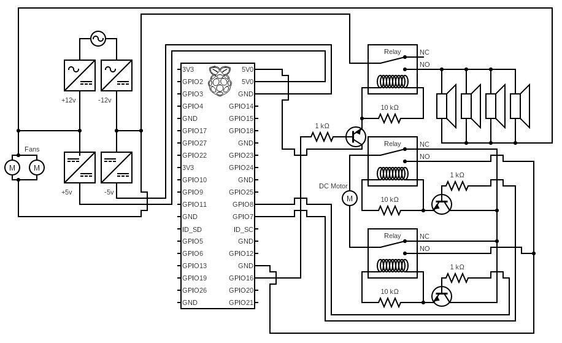

# CHIRP Surveillance System – Developer Documentation

Welcome to the developer documentation for the CHIRP Surveillance System. This project combines motion detection, GPIO-controlled alarms, and a rotating camera turret. This document is designed for future developers who will maintain, expand, and integrate new functionality into the system.

---

## Project Structure

| File/Folder        | Purpose |
|--------------------|---------|
| `main.py`          | Initializes the system and runs the event loop. |
| `MotionDetector.py`| Handles video capture, frame processing, motion detection, and system coordination. |
| `sentryTurret.py`  | Rotates the camera platform using GPIO. Alternates direction, supports pause/resume. |
| `alert_system.py`  | Controls a buzzer/siren to alert on motion. |
| `recordings/`      | Folder where video clips are stored if recording is enabled. |
| `circuit.JPEG`     | Wiring diagram image. |
| `USER_GUIDE.md`    | For non-developers; installation and usage guide. |
| `DEVELOPER_DOCS.md`| (This file) Overview for developers. |

## Module Descriptions

### `main.py`
- Entry point of the system.
- Creates a `Sentry` object and injects it into `MotionDetector`.
- Handles shutdown on `KeyboardInterrupt`.

### `MotionDetector.py`
- Uses PiCamera2 to continuously capture video frames.
- Applies frame differencing and contour detection for motion.
- Pauses turret rotation when motion is detected.
- Records video clips when `recording=True`.
- Has logic to prevent false motion detection during rotation.

### `sentryTurret.py`
- Controls GPIO pins to rotate the camera left and right.
- Background thread continuously switches rotation direction after a configurable number of cycles.
- Uses methods to pause/resume/stop the turret safely.

### `alert_system.py`
- Uses GPIO to sound a buzzer.
- Can repeat buzzer for a specified duration and number of cycles.
- Contains a `cleanup()` method to safely release GPIO.

---

## System Configuration

Key parameters in `main.py` and modules:

- `rotate_duration`: How long to rotate per cycle (e.g. 0.15s).
- `wait_duration`: Time between each rotation step (e.g. 8s).
- `rotations_before_switch`: Number of cycles before changing direction.
- `MINIMUM_MOTION_AREA`: Minimum contour area to be considered motion (default: 3000).
- `MOTION_PERSISTENCE_DURATION`: Number of frames to persist detection (default: 50).

---

## Important Concepts

- **Post-Rotation Delay**: After a rotation ends, motion detection is paused briefly (1s) to prevent false detection.
- **Frame Differencing**: Motion is detected using grayscale frame subtraction, thresholding, and contour area.
- **Headless Mode**: Automatically disables OpenCV windows if `DISPLAY` environment is not available (e.g. via SSH).

---

### Reference Image

## Future Improvements

Here are some potential features to consider if contributing:

| Feature | Description |
|--------|-------------|
| Email alerts | Automatically send motion detection alerts via email. SMTP stub already in `alert_system.py`. |
| Cloud sync | Upload videos to Google Drive or S3. |
| Web dashboard | Create a Flask or Node.js dashboard for live streaming and alerts. |
| AI vision | Replace basic frame differencing with YOLO or another object detection model. |
| Facial recognition | Identify specific people (e.g., whitelist/blacklist visitors). |
| Auto-calibration | Dynamically set rotation parameters based on stepper motor specs. |

---

## Contributing Notes

- Always call `.stop()` or `.cleanup()` to avoid GPIO resource issues.
- Be cautious when modifying rotation timing — incorrect values may cause mechanical strain.
- There is a 1 second period upon rotation completion where any detected motion is ignored to prevent false positives.
